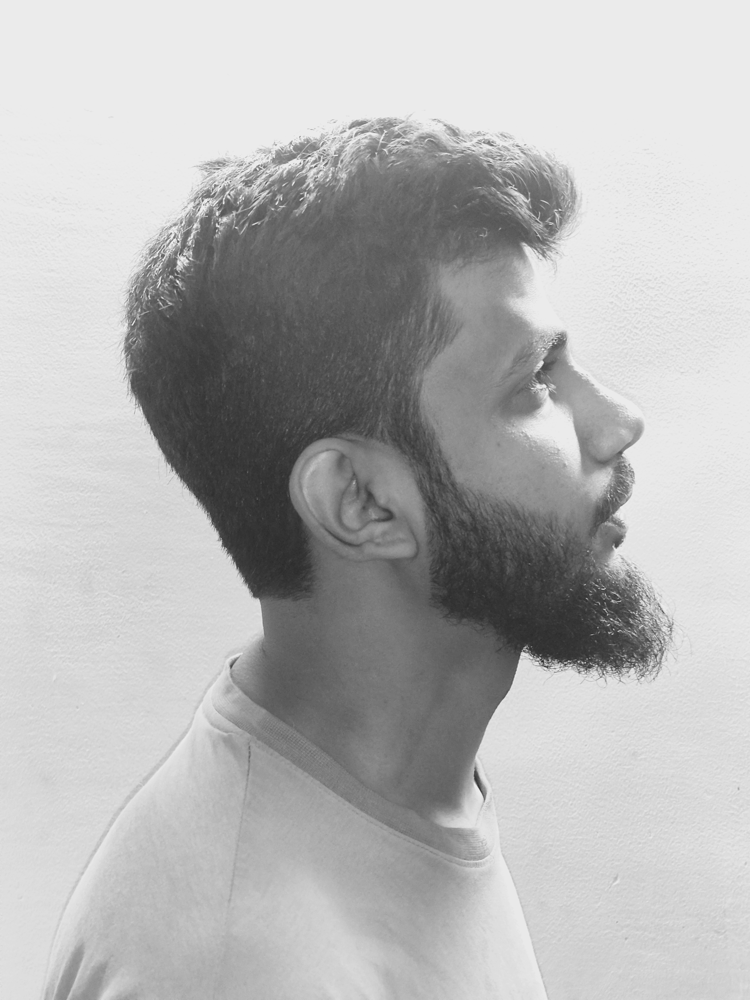

# Mohammad Kaif's Portfolio



A clean, responsive personal portfolio website showcasing my skills, projects, and contact information as a web developer.

Live Demo: [https://mdk4if.github.io/portfolio/](https://mdk4if.github.io/portfolio/)

## Description

This is my personal portfolio site, designed to highlight my background in web development. It features a minimalist black-and-white theme with smooth navigation and mobile responsiveness. Built with pure HTML, CSS, and no JavaScript dependencies for simplicity and performance.

## Features

- **Responsive Design**: Adapts seamlessly to desktop, tablet, and mobile devices using CSS media queries.
- **Navigation**: Simple top nav bar with links to sections (Introduction, About, Skills, Projects, Contact).
- **Sections**:
  - **Introduction**: Centered hero with my name.
  - **About Me**: Brief overview of my focus on clean, user-friendly web tech.
  - **Skills**: List of core technologies (HTML, CSS, JavaScript, Python, Bash Scripting, Git & GitHub).
  - **Projects**: Highlights of key projects (Portfolio Website, Landing Page, CLI Chat Application).
  - **Contact**: Email, GitHub, and phone details.
- **Styling**: System fonts, bordered sections, and a darkened profile image for a modern, professional look.
- **Accessibility**: Semantic HTML, alt text for images, and keyboard-friendly navigation.

## Tech Stack

- **Frontend**: HTML5, CSS3 (Flexbox for layout, media queries for responsiveness)
- **Deployment**: GitHub Pages
- **Tools**: Git for version control

## Getting Started

### Prerequisites

- A GitHub account (for deployment).
- Basic knowledge of HTML/CSS (optional, as it's ready-to-use).

### Local Setup

1. Clone the repository:
   ```
   git clone https://github.com/mdk4if/portfolio.git
   cd portfolio
   ```

2. Open `index.html` in your browser (e.g., Chrome, Firefox) to view locally.

3. Edit files as needed:
   - Update `profilePicture.jpg` with your image.
   - Modify content in `index.html`.
   - Tweak styles in `style.css`.

### Deployment

This site is already deployed via GitHub Pages! To update:

1. Make changes locally.
2. Commit and push:
   ```
   git add .
   git commit -m "Update portfolio content"
   git push origin main
   ```
3. GitHub Pages will auto-deploy from the `main` branch. Changes go live in 1-5 minutes.

## Screenshots

### Desktop View
 <!-- Add actual screenshots to a 'screenshots' folder -->

### Mobile View


*(Tip: Add real screenshots to a `screenshots/` folder and update links for better visuals.)*

## Future Improvements

- Add JavaScript for smooth scrolling or animations.
- Integrate a contact form (e.g., via Formspree).
- Expand projects with live links and descriptions.
- Theme toggle (light/dark mode).

## Contact

Feel free to reach out!

- **Email**: [mohammad.kaif3140@gmail.com](mailto:mohammad.kaif3140@gmail.com)
- **GitHub**: [github.com/mdk4if](https://github.com/mdk4if)
- **Phone**: +91 9170505164

## License

This project is open-source and available under the MIT License. See [LICENSE](LICENSE) for details (or add one if not present).

---

Built with ❤️ by Mohammad Kaif. Last updated: January 2026.
